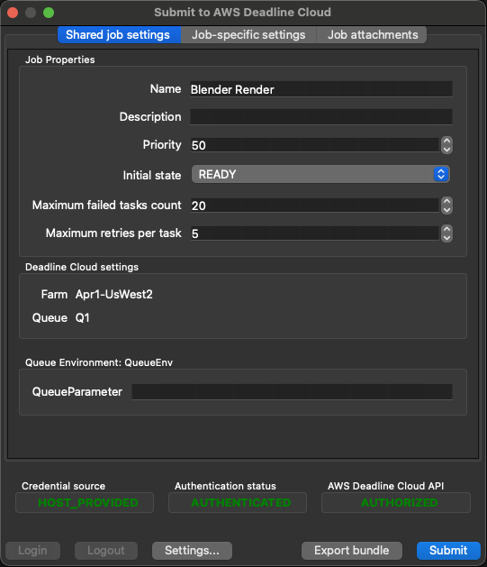
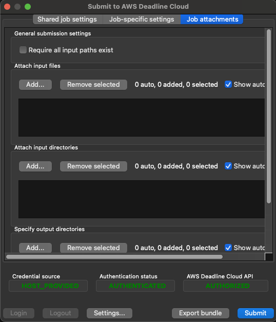

# AWS Deadline Cloud job bundles

Job bundles are the easiest way to define your jobs for AWS Deadline Cloud. They encapsulate
an [Open Job Description job template](https://github.com/OpenJobDescription/openjd-specifications/wiki) into a directory
with additional information such the files and directories that your Jobs need. Read more about
how to [build a job bundle](https://docs.aws.amazon.com/deadline-cloud/latest/developerguide/build-job-bundle.html)
in the Deadline Cloud developer guide. See the [example Blender job submission](#example-blender-job-submission) below
for more about submitting these jobs to your farm.

## Job bundle index

This list highlights just a few of the available job bundles. Browse the directory directly to discover the rest!

### Jobs for the Deadline Cloud developer guide

The [simple_job](simple_job/template.yaml) job bundle supplements the Deadline Cloud developer guide
[set up a developer farm section](https://docs.aws.amazon.com/deadline-cloud/latest/developerguide/getting-started-dev.html).
You can step through its instructions to get a developer-focused overview, using the AWS and Deadline Cloud CLIs to create a farm, queue,
and fleets, submit jobs, and see the details of how job attachments work.

The job bundles [job_env_vars](job_env_vars/template.yaml), [job_env_with_new_command](job_env_with_new_command/template.yaml), and
[job_env_daemon_process](job_env_daemon_process/template.yaml) supplement the developer guide
[control the job environment section](https://docs.aws.amazon.com/deadline-cloud/latest/developerguide/control-the-job-environment.html).
These jobs show how to use [Open Job Description environments](https://github.com/OpenJobDescription/openjd-specifications/wiki/2023-09-Template-Schemas#4-environment).
Look at the [queue environment samples](../queue_environments) for more ideas.

The job bundles [job_attachments_devguide](job_attachments_devguide) and [job_attachments_devguide_output](job_attachments_devguide_output)
supplement the developer guide [job attachments section](https://docs.aws.amazon.com/deadline-cloud/latest/developerguide/build-job-attachments.html).
Learn how data flow metadata on path job parameters and the job bundle `asset_references.yaml` file work together to describe the files
a job needs as input, and produce as output. When job bundles specify this metadata, they can work with either job attachments or shared file systems.

### CLI job

The [cli_job](cli_job/template.yaml) job bundle is a way to submit a multi-line bash script to Deadline Cloud. The script job parameter uses a multi-line
edit control, and a data directory job parameter lets you select a directory of data for the script to read from and write to.

### GUI control showcase

The [gui_control_showcase](gui_control_showcase/template.yaml) job bundle shows every GUI control that user interface metadata
on [Open Job Description job parameters](https://github.com/OpenJobDescription/openjd-specifications/wiki/2023-09-Template-Schemas#2-jobparameterdefinition)
support.

### Job development progression

Developing a job bundle can start small and simple, then grow complex as you add more job parameters, steps, and scripts.
The [job_dev_progression](job_dev_progression) directory contains a sequence of four job bundle development stages to help
manage that growing complexity. Read through the code and run these jobs on your Deadline Cloud farm to get a feel for it.

### Digital content creation (DCC) render jobs

The [blender_render](blender_render/template.yaml) job bundle shows how to support a CLI application in about 100 lines of YAML. A majority of
the template is metadata for the job parameters, defining the parameter names, types, defaults, and user interface metadata.
The step definition includes a parameter space to define a task for each frame for a range expression in the Frames job parameter,
and a short script that substitutes job parameters and the Frame task parameter into a script command for each task.

* [blender_render](blender_render/template.yaml)
* [keyshot_standalone](keyshot_standalone)
* [afterfx_render_one_task](afterfx_render_one_task)
* [maya_cli_render](maya_cli_render)
* [houdini_husk_usd_render](houdini_husk_usd_render)
* [vray_render](vray_render/template.yaml)

If you've created a similar job for your favorite DCC, see [CONTRIBUTING.md](../CONTRIBUTING.md) for how to add it here.

### Turntable job with Maya/Arnold

The [turntable_with_maya_arnold](turntable_with_maya_arnold) job bundle is an example pipeline utility job for taking a 3D model
stored as an OBJ file, and creating a turntable render video. It demonstrates how someone comfortable with YAML
and scripting in a digital content creation (DCC) application can create utility jobs that are easy to submit from a GUI.

### Tile render job with Maya/Arnold and FFmpeg

The [tile_render_with_maya_arnold](tile_render_with_maya_arnold) job bundle demonstrates a two-step job that first renders
all the frames in tiles using a 3-dimensional task parameter space (Frame * TileNumberX * TileNumberY), and then assembles
all the tiles for each frame using FFmpeg. It includes a simple scene and default parameters to make it simple to try out.

The [tile_render_maya_ffmpeg_for_blogpost](tile_render_maya_ffmpeg_for_blogpost) job bundle goes with the blog post
[Create a tile rendering job with modifications for AWS Deadline Cloud](https://aws.amazon.com/blogs/media/create-a-tile-rendering-job-with-modifications-for-aws-deadline-cloud/)
that walks through customizing one of the Deadline Cloud adaptors and writing a tile rendering job template.

### Copy S3 prefix to job attachments

The [copy_s3_prefix_to_job_attachments](copy_s3_prefix_to_job_attachments) job bundle can help you pre-populate a queue's
job attachment S3 bucket with data files by copying them from where they are already stored on S3. It scans the source
S3 prefix, then distributes the hashing and data copies across a number of workers you specify. Because job attachments
uses content-addressed storage for data files, users that later submit jobs with these files attached will not have to
upload them.

## Example Blender job submission

With a job bundle in hand, the [Deadline Cloud CLI](https://github.com/aws-deadline/deadline-cloud) provides ways for you
to submit jobs to run on your Deadline Cloud queues. Read more about
[how to submit a job](https://docs.aws.amazon.com/deadline-cloud/latest/developerguide/submit-jobs-how.html)
in the Deadline Cloud developer guide.

Here's the submitter GUI you can see after [configuring the Deadline Cloud CLI](https://github.com/aws-deadline/deadline-cloud/blob/mainline/README.md#configuration)
and running `deadline bundle gui-submit blender_render/` in this samples directory:

  

Alternatively, you can submit this job bundle with the command
`deadline bundle submit --name Demo -p BlenderSceneFile=<location-of-your-scene-file> -p OutputDir=<file-path-for-job-outputs> blender_render/`
or use the `deadline.client.api.create_job_from_job_bundle` function in the [`deadline` Python package](https://github.com/aws-deadline/deadline-cloud).
If you do not want to use the `deadline` Python package's support for features like job attachments, you can also submit the job template by calling the
[deadline:CreateJob API](https://docs.aws.amazon.com/deadline-cloud/latest/APIReference/API_CreateJob.html) directly.

## Example Husk USD Render with Asset Introspection 

The [houdini_husk_usd_render](houdini_husk_usd_render) sample shows how to use the Houdini Husk CLI USD renderer using a short job template and service-provided Conda packages.
Additionally, this sample shows how to write a custom asset introspection tool for job attachments, ensuring that only the required data is uploaded when using job attachments 
while removing manual steps of the artists having to attach the required files.